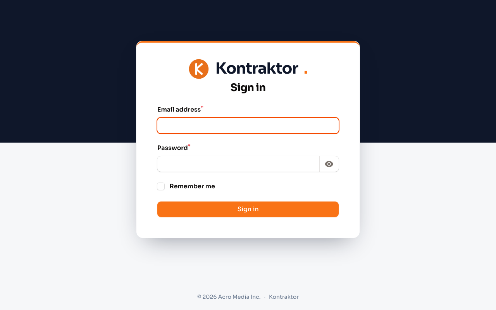
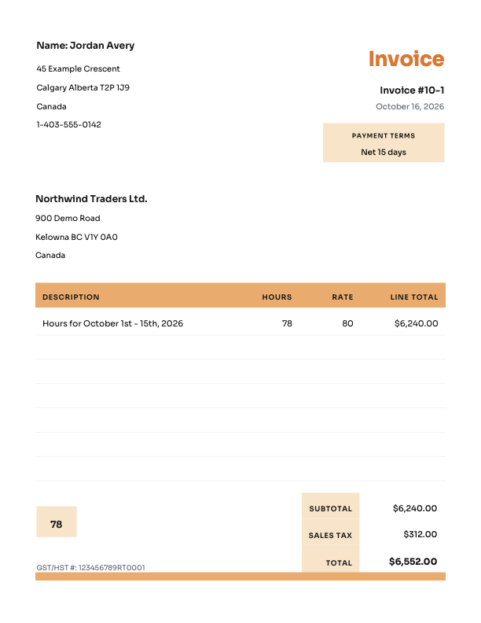

# Kontraktor

**Contractor invoicing, minus the spreadsheet gymnastics.** Pull hours from Harvest, preview the invoice, download it as a professional PDF or editable Excel file, and track it through Draft → Sent → Paid — all in a multi-contractor app with an admin view.



## What it does

### For contractors

- **Harvest integration** — connect a personal access token once; the Harvest page pulls real time entries for any period, groups them by day and project, and estimates the invoice before you commit
- **Preview before create** — New Invoice shows the invoice exactly as it will print: number, period, lines, tax, total. Edit the invoice number right on the preview. Nothing saves until you confirm
- **Three ways to get hours in** — Harvest pull, Excel timesheet upload, or manual lines
- **PDF + Excel downloads** — the PDF matches a professional invoice layout; the `.xlsx` keeps live formulas (`=hours×rate`, `=SUM`, tax rounding) for the old-school workflow
- **Status tracking** — mark Sent when it goes out, mark Paid when the money lands. Back-to-draft / back-to-sent undo for corrections
- **Rates with history** — effective-dated hourly rates; old invoices keep the rate they were billed at
- **Own clients** — create private billing entities; shared clients (managed by admins) are visible to everyone
- **Dashboard** — outstanding total, paid this year, hours, earnings chart, status breakdown, recent invoices

### For admins

- Everything above, plus **every contractor's invoices** — filter by status, contractor, or period; footer sums; CSV export
- **Contractor management** — create contractor logins and their billing profiles in one step (rate history, tax rate, payment terms, invoice-number pattern)
- **Shared clients** — billing entities visible to all contractors; contractor-created clients stay private
- **Backfill import** — Excel upload of historical invoices, validated and deduplicated



## Stack

- **Laravel 13** + **Filament 5** admin panel
- **SQLite** locally, **MySQL** in production
- **Harvest REST API v2** (personal access tokens, encrypted at rest)
- **barryvdh/laravel-dompdf** for PDFs, **maatwebsite/excel** for imports/exports
- **Sora** UI font — embedded in PDFs too
- PHPUnit feature/unit suite (85+ tests)

## Quickstart

```bash
composer install
npm install

cp .env.example .env
php artisan key:generate
touch database/database.sqlite
php artisan migrate --seed
npm run build

php artisan serve
```

Then open `http://localhost:8000/admin`:

| Role | Login | Password |
|---|---|---|
| Admin | `admin@kontractor.test` | `password` |
| Contractor | `contractor@kontractor.test` | `password` |

Seeding creates a demo admin, a demo contractor profile, and a shared client — no invoices. Optional: `php artisan db:seed --class=DemoHistorySeeder` adds a year of fake invoices for dashboards/report demos.

## Connecting Harvest

Each contractor sets their own credentials on **My Profile → Harvest**:

1. In Harvest: **Settings → Developer Tools → Personal Access Tokens** → create one
2. Copy the token and the Account ID shown beside it
3. Paste both into the profile — the app verifies them against Harvest before saving

Harvest tokens are AES-encrypted in the database. Once an invoice is created, the raw pulled entries are frozen on it (`source_payload`), so later edits in Harvest can't rewrite history.

## Invoice workflow

```
period → source → preview → Draft → Sent → Paid
                              ↑____________|
                            (retract to fix)
```

- Numbers default to `{MM}-{seq}` per month per contractor (e.g. `10-1`) — editable on the preview step; duplicates rejected with the next available number
- Deleting a draft frees its number for reuse
- Only drafts are editable/deletable; sent invoices retract to draft to correct

## Importing history

**Settings → Backfill Import** (admin): upload an Excel/CSV with

`contractor_email, invoice_number, period_start, period_end, invoice_date, hours, rate, total, status`

Invalid rows are reported per-row before anything commits. Downloadable template provided.

## Tests

```bash
php artisan test       # full suite
./vendor/bin/pint      # code style
```

Coverage includes invoice numbering, totals/tax math, period presets, Harvest calls (HTTP-faked), PDF rendering, tenant isolation (contractors can't see each other's data), authorization on every action, and the full status lifecycle.

## Security notes

- No secrets in the repo — `.env` and all databases are gitignored
- Cross-tenant reads return **404**, not 403 (don't leak existence)
- Table actions don't auto-authorize in Filament 5 — every destructive/status action is explicitly gated and tested
- A `/dev/login/{email}` shortcut exists for local previews; it is **hard-gated to `APP_ENV=local`** — production must run `APP_ENV=production`
- Password reset / email invites aren't built yet — admins set temporary passwords out-of-band today

## Roadmap

- Email invites + password reset flow
- GCP deployment (Cloud Run + Cloud SQL MySQL)
- Mid-period rate changes split by date
- Non-billable day tagging (sick / vacation / stat holidays) on invoices
- Object storage for generated PDFs

---

Kontraktor · Sora font © The Sora Project Authors, OFL
